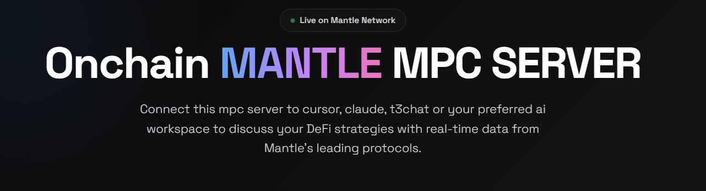

# Mantle Network MPC Server

<div align="center">
  
  <br>
  <p>
    <a href="https://mantle-mcp.vercel.app"></a>
    <a href="https://github.com/OkeyAmy/mantle-mcp/blob/main/LICENSE"></a>
    <a href="https://www.typescriptlang.org/"></a>
    <a href="https://www.mantle.xyz/"></a>
  </p>
</div>

A modern UI interface for interacting with Mantle Network's DeFi protocols through an MPC (Multi-Party Computation) server. This project provides real-time data and analytics for various DeFi protocols on Mantle Network.

## ✨ Overview

This third-party MPC Server serves as a bridge between AI workspaces and Mantle Network's DeFi ecosystem. It enables users to query real-time data about token prices, total value locked (TVL), and protocol-specific metrics directly from their AI workspaces like Cursor, Claude, and T3Chat.

With a sleek glassmorphic UI design, the server provides an intuitive interface for visualizing and interacting with onchain data, making it easier to analyze DeFi trends and make informed decisions.

## 🌟 Features

- **Real-time Token Data**: Get live price updates for any token on Mantle Network using contract addresses
- **Comprehensive TVL Analytics**: View total value locked metrics across the network and for specific tokens
- **Protocol Insights**: Deep analytics for major protocols like Merchant Moe and Treehouse
- **Interactive UI**: Modern glassmorphic design with responsive layouts and animations
- **AI Workspace Integration**: Seamless connection with AI tools like Cursor, Claude, and T3Chat
- **Live Data Streaming**: Real-time updates through server-sent events (SSE)
- **Type-safe Implementation**: Built with TypeScript for robust code quality

## 📊 Supported Protocols

- **[Treehouse Protocol](https://defillama.com/protocol/treehouse-protocol)**: Leading lending platform on Mantle
- **[Merchant Moe](https://defillama.com/protocol/merchant-moe)**: Innovative DEX on Mantle Network

## 🏗️ Project Structure

```
mantle-mcp/
├── api/               # API endpoints for the MPC server
├── lib/               # Core libraries and utility functions
├── public/            # Static assets and UI
│   ├── index.html     # Main UI interface
│   └── mantle.png     # Project image assets
├── scripts/           # Utility scripts
│   └── test-client.mjs # Test client for MPC server
├── .gitignore         # Git ignore file
├── package.json       # Project dependencies
├── README.md          # Project documentation
├── tsconfig.json      # TypeScript configuration
└── vercel.json        # Vercel deployment configuration
```

## 🛠️ Available Tools

The MPC server provides the following tools for interacting with Mantle Network:

### Token Price Tool
```javascript
{
  name: 'get-token-price',
  description: 'Get the price of a token in mantle network',
  parameters: {
    contract_address: 'string'
  }
}
```

### Total Value Locked (TVL) Tools
```javascript
{
  name: 'get-ltv',
  description: 'Get the total value locked of mantle network'
}

{
  name: 'get-USDT-tvl',
  description: 'Get the total value locked of USDT on Mantle'
}

{
  name: 'get-USDC-tvl',
  description: 'Get the total value locked of USDC on Mantle'
}
```

### Protocol Analytics Tools
```javascript
{
  name: 'get-protocol-merchant-moe-summary',
  description: 'Get key metrics for the Merchant Moe protocol on Mantle'
}

{
  name: 'get-protocol-treehouse-protocol-summary',
  description: 'Get key metrics for a Tree House on Mantle'
}
```

## 🚀 Getting Started

### Prerequisites

- Node.js 16.x or higher
- npm or yarn
- Basic understanding of DeFi and Mantle Network

### Installation

1. Clone the repository:
```bash
git clone https://github.com/OkeyAmy/mantle-mcp.git
cd mantle-mcp
```

2. Install dependencies:
```bash
npm install
# or with yarn
yarn install
```

3. Test the MPC server connection:
```bash
node scripts/test-client.mjs
```

4. Start the UI server:
```bash
npx serve public
# The UI will be available at http://localhost:3000
```

### Deployment

The project is configured for easy deployment on Vercel:

```bash
# Install Vercel CLI
npm install -g vercel

# Deploy
vercel
```

## 🔌 AI Workspace Integration

To integrate with your AI workspace, add the following configuration to your MCP config:

```json
{
  "mcpServers": {
    "onchain-context": {
      "type": "remote",
      "url": "https://mantle-mcp.vercel.app/sse",
      "supportsStreaming": true
    }
  }
}
```

### Usage Examples

#### Claude & Cursor

1. Configure your workspace with the MCP config
2. Ask questions like:
   ```
   What's the current TVL of Mantle Network?
   ```
   ```
   What's the price of MNT token at contract address 0x1234...?
   ```

#### T3Chat

Follow similar configuration steps as above, then use the interface to query data directly through your chat interface.

## 🎯 Sample Prompts

Here are some example prompts you can try with each tool:

### Token Price Queries
1. "What is the current price of USDT on Mantle? Please use the contract address 0x123..."
2. "Can you track the price movement of MNT token over the last hour using its contract address?"

### TVL Analysis
1. "What is the total value locked in the entire Mantle Network right now?"
2. "Compare the TVL between USDT and USDC on Mantle Network and show me the difference."

### Protocol Metrics
1. "Show me the key performance metrics for Merchant Moe, including trading volume and liquidity."
2. "What are the current lending rates and total deposits in the Treehouse Protocol?"

### Combined Analysis
1. "Give me a comprehensive overview of Mantle's DeFi ecosystem, including TVL, top protocols, and stablecoin metrics."
2. "Analyze the relationship between MNT token price and Treehouse Protocol's TVL."

## 🎨 UI Customization

The interface uses a modern glassmorphic design with:
- Smooth transitions and hover states
- Dynamic background blur effects
- Responsive layout for mobile and desktop
- Animated components for better user engagement
- High contrast for accessibility

You can customize the UI by modifying the styles in `public/index.html`.

### Key UI Components:

- **Navbar**: Fixed top navigation with quick access links
- **Hero Section**: Introduces the MPC server with animation
- **GitHub Integration**: Links to the repository with tech details
- **Protocol Cards**: Information about supported protocols
- **Feature Highlights**: Showcases key features with icons
- **Integration Guide**: Code snippet for connecting to AI tools
- **Tools Documentation**: Details about available API tools

## 📊 Data Sources

- **Mantle Network RPC**: Direct blockchain data access
- **DeFiLlama API**: Aggregated TVL and protocol metrics
- **Protocol-specific APIs**:
  - Merchant Moe for DEX-related data
  - Treehouse for lending platform statistics

## 🤝 Contributing

Contributions are welcome and appreciated! Here's how you can contribute:

1. **Fork** the repository
2. Create a **branch** for your feature (`git checkout -b feature/amazing-feature`)
3. **Commit** your changes (`git commit -m 'Add some amazing feature'`)
4. **Push** to the branch (`git push origin feature/amazing-feature`)
5. Open a **Pull Request**

Please ensure your code follows the project's coding style and includes appropriate tests.

## 📝 License

This project is licensed under the MIT License - see the [LICENSE](LICENSE) file for details.

## 🔗 Links & Resources

- [Mantle Network](https://www.mantle.xyz/)
- [Mantle Docs](https://docs.mantle.xyz/)
- [DeFiLlama](https://defillama.com/chain/Mantle)
- [Merchant Moe](https://defillama.com/protocol/merchant-moe)
- [Treehouse Protocol](https://defillama.com/protocol/treehouse-protocol)
- [GitHub Repository](https://github.com/OkeyAmy/mantle-mcp)
- [Live Demo](https://mantle-mcp.vercel.app)

## 📧 Contact

For questions, suggestions, or collaboration opportunities, please open an issue on GitHub or reach out through the repository contacts.

---

<div align="center">
  <p>An independent project for the Mantle ecosystem</p>
</div>
